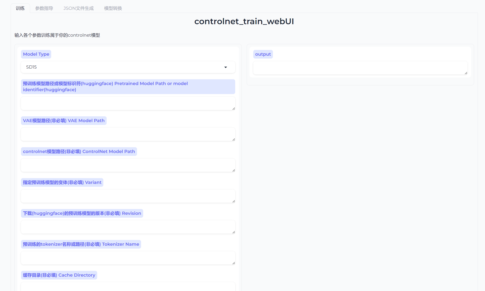
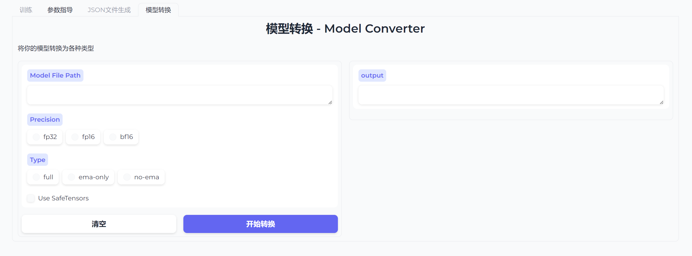
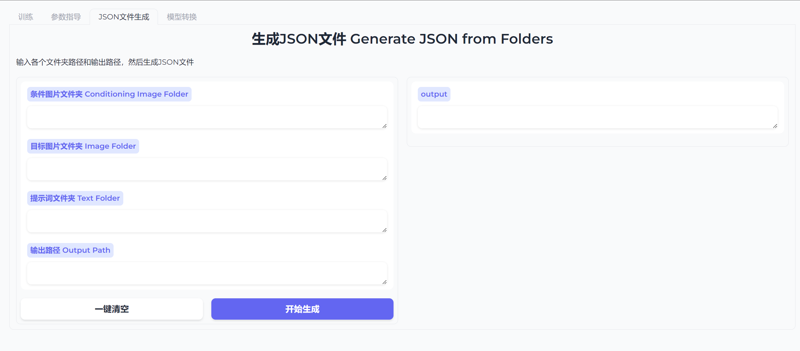

<p align="left">
    中文</a>&nbsp ｜ &nbsp<a href="readme_en.md">🌍 EN</a>&nbsp
</p>

📃 **controlnet_train_webUI** (原 [controlnet_TrainingPackage](https://github.com/wusongbai139/controlnet_TrainingPackage))

<br>

---

<br>

## 目录  
 <br>

* [概述](README.md#概述)
* [文件介绍](README.md#文件介绍)
* [安装部署](README.md#安装部署)
    * [环境推荐](README.md#环境推荐)
    * [安装依赖](README.md#安装依赖)
    * [预训练模型下载](README.md#预训练模型下载)
* [训练流程](README.md#训练流程)
* [开发计划](README.md#开发计划)
* [联系](README.md#联系)

<br>

___

<br>

## 概述

<br>
🤖️ 利用diffusers编写的训练controlnet模型的项目，计划集成训练各种预训练模型的controlnet模型的方案。

📦 本项目包含：
* 训练界面
* 参数指导
* JSON文件生成
* 模型转换

✅ 项目特点：
* 方便实用，脚本或者UI界面都可以使用
* 支持训练SD1.5和SDXL的controlnet模型

<br>

___
<br>

## 文件介绍

| 文件       | 功能                             |
|-----------|-----------------------------------|
| gradio_train_cn.py     |     可以有交互操作的UI界面
| controlnet_train_15andXL.py     | 训练代码，可以直接使用训练模型      ||
| controlnet_train.ps1     | 训练脚本，可以在脚本中写入参数而使用  ||
| convert_model.py | 配合UI界面的转换模型文件 ||
| gen_json_file.py     | 配合UI界面的json文件生成文件   ||
| gen_json.py    | 可以独立使用的json文件生成文件   ||
| params_guidance.md    | 记录了各种参数           ||
| requirements.txt     | 记录环境依赖文件 |

<br>

___

<br>

## 安装部署
<br>

### 环境推荐
[](https://pypi.org/project/pypiserver/) 


### 安装依赖（推荐使用conda部署）
1. 建立虚拟环境+安装依赖。
2. 建立环境：```conda create --name controlnettrain python=3.10```
3. 激活环境：```conda activate controlnettrain```
4. 安装其他依赖：```pip install -r requirements.txt ```
5. 在终端中输入：```python gradio_train_cn.py``` 启动页面
6. 在激活的环境中输入：```pip install xformers ``` 启用xformers的内存高效注意力机制

<br>

模型训练页面：

参数指导页面：

模型转换页面：

JSON文件生成页面


<br>

### 预训练模型下载

1. SD15模型
- 模型下载地址：[https://huggingface.co/runwayml/stable-diffusion-v1-5/tree/main](https://huggingface.co/runwayml/stable-diffusion-v1-5/tree/main)
- 需要下载的文件：
    ```
    stable-diffusion-v1-5
    |-- feature_extractor
    |-- safety_checker
    |-- scheduler
    |-- text_encoder
    |-- tokenizer
    |-- unet
    |-- vae
    ```
2. SDXL模型
- 模型下载地址：[https://huggingface.co/stabilityai/stable-diffusion-xl-base-1.0/tree/main](https://huggingface.co/stabilityai/stable-diffusion-xl-base-1.0/tree/main)
- 需要下载的文件：
    ```
    stable-diffusion-xl-base-1.0
    |-- scheduler
    |-- text_encoder
    |-- text_encoder_2
    |-- tokenizer
    |-- tokenizer_2
    |-- unet
    |-- vae
    ```
3. 模型放置
放在任意路径即可，但是为了管理方便，建议在训练根目录下建立相关文件，统一管理。

<br>

___

<br>

## 训练流程

<br>

1. 制作训练集，准备目标图片、条件图片与提示词文件；
- 目标图片是指你期望用模型生成什么图片，放在image文件夹中；
- 条件图片是指从原始图片中提取的特征图片，放在conditioning_image文件夹中；
- 提示词文件是与目标图片匹配的提示词文件，放在text文件夹中。
- 文件夹命名一定要准确。
2. 在webUI中使用JSON文件生成工具制作train.json文件；
4. 在训练页面中填写参数；
5. 开始训练；
6. 如果感觉得到的模型很大，可以在模型转换页面中转换模型。

<br>

___

<br>

## 开发计划

<br>

- controlnet 
  - [x] controlnet
  - [x] controlnet_lllite（轻量版本）
- Pretrained Model
  - [x] SD15
  - [x] SDXL
  - [ ] SD3
  - [ ] Kolors
- train
  - [ ] 一键安装包
  - [ ] 更多新功能（优化器、参数等）

<br>

___

<br>

## 联系：

<br>
ai松柏君

📧：aisongbaijun@163.com 

X：[](https://x.com/songbai20)

B站主页：https://space.bilibili.com/523893438?spm_id_from=333.1007.0.0