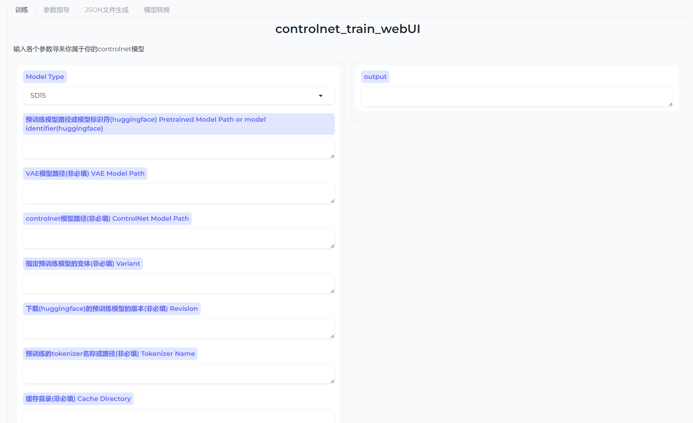

<p align="left">
    🌍 EN</a>&nbsp ｜ &nbsp<a href="readme.md">中文</a>&nbsp
</p>

📃 **controlnet_train_webUI** (Original project address： [controlnet_TrainingPackage](https://github.com/wusongbai139/controlnet_TrainingPackage))

<br>

---

<br>

## Directory  
 <br>

* [Overview](README.md#overview)
* [Document](README.md#Document)
* [Deployment](README.md#Deployment)
    * [Environment](README.md#Environment)
    * [Install](README.md#Install)
    * [Model Download](README.md#ModelDownload)
* [Training](README.md#训练流程)
* [plan](README.md#plan)
* [contact](README.md#contact)

<br>

___

<br>

## overview

<br>
🤖️ The project of training the ControlNet model using diffusers is planned to integrate the training of various pre trained ControlNet models.

📦 This project includes:
* Training interface
* Parameter guidance
* JSON file generation
* Model conversion

✅ Project features:
* Convenient and practical, both scripts and UI interfaces can be used
* Support the training of ControlNet models for SD1.5 and SDXL

<br>

___
<br>

## Document Introduction

| file name     | function                             |
|-----------|-----------------------------------|
| gradio_train_cn.py     |     UI interface with interactive operation面
| controlnet_train_15andXL.py     | Training code can be directly used to train the model      ||
| controlnet_train.ps1     | Training script, which can be used by writing parameters in the script  ||
| convert_model.py | Convert model files in conjunction with the UI interface ||
| gen_json_file.py     | Generate a JSON file in conjunction with the UI interface   ||
| gen_json.py    | Generate files from JSON files that can be used independently   ||
| params_guidance.md    | Recorded various parameters   ||
| requirements.txt     | Record environment dependency files |

<br>

___

<br>

## Install
<br>

### Environment
[](https://pypi.org/project/pypiserver/) 


### Install
(Recommended to use conda deployment)
1. Establish a virtual environment and install dependencies.
2. Create environment: conda create -- name controlletrain Python=3.10
3. Activation environment: conda activate control net rain
4. Install other dependencies: pip install - r requirements. txt
5. Enter: python gradio_train_cn.py startup page in the terminal

### ModelDownload

1. SD15
- Model download address：[https://huggingface.co/runwayml/stable-diffusion-v1-5/tree/main](https://huggingface.co/runwayml/stable-diffusion-v1-5/tree/main)
- Files that need to be downloaded：
    ```
    stable-diffusion-v1-5
    |-- feature_extractor
    |-- safety_checker
    |-- scheduler
    |-- text_encoder
    |-- tokenizer
    |-- unet
    |-- vae
    ```
2. SDXL
- Model download address：[https://huggingface.co/stabilityai/stable-diffusion-xl-base-1.0/tree/main](https://huggingface.co/stabilityai/stable-diffusion-xl-base-1.0/tree/main)
- Files that need to be downloaded：
    ```
    stable-diffusion-xl-base-1.0
    |-- scheduler
    |-- text_encoder
    |-- text_encoder_2
    |-- tokenizer
    |-- tokenizer_2
    |-- unet
    |-- vae
    ```
3. Model file location
It can be placed in any path, but for the convenience of management, it is recommended to create relevant files in the training root directory for unified management.

<br>

___

<br>

## Training

<br>

1. Create a training set, prepare target images, condition images, and prompt word files;
- The target image refers to what image you expect to be generated using the model and placed in the image folder;
- Conditional images refer to feature images extracted from the original image and stored in the conditioning_image folder;
- The prompt word file is a prompt word file that matches the target image and is placed in the text folder.
- Folder naming must be accurate.
2. Use a JSON file generation tool in the webUI to create a train.exe file;
4. Fill in the parameters on the training page;
5. Start training;
6. If you feel that the model is large, you can convert it on the model conversion page.

<br>

___

<br>

## plan

<br>

- controlnet 
  - [x] controlnet
  - [ ] controlnet_lllite
- Pretrained Model
  - [x] SD15
  - [x] SDXL
  - [ ] SD3
  - [ ] Kolors
- train
  - [ ] portable standalone build

<br>

___

<br>

## contact

<br>

📧：aisongbaijun@163.com 

Bilibili：https://space.bilibili.com/523893438?spm_id_from=333.1007.0.0